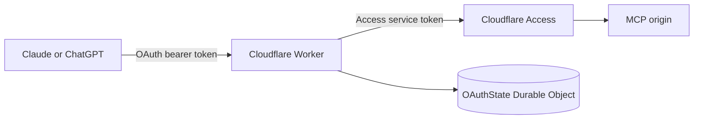

# Cloudflare MCP OAuth Proxy

Cloudflare Worker for confidential OAuth connections from Claude.ai and ChatGPT to an MCP server
protected by Cloudflare Access. The Worker validates OAuth tokens, then presents a Cloudflare
Access service token to the upstream MCP hostname.

This is a Cloudflare Worker project, not a Cloudflare Pages Functions project.

## Architecture

The SQLite-backed `OAuthState` Durable Object atomically consumes authorization codes, rotates
refresh tokens, detects refresh-token replay, and rate-limits authorization password failures.
Durable Objects are available on Cloudflare Workers Free and Paid plans.

## Worker Configuration

Set these as Cloudflare dashboard text variables:

- `MCP_ORIGIN`: protected upstream HTTPS origin, such as `https://mcp.example.com`. Do not include a
  path.
- `OAUTH_PUBLIC_ORIGIN`: public HTTPS origin of this Worker, such as
  `https://mcp-api.example.com`. The Worker rejects alternate hosts and plaintext HTTP.
- `CF_SERVICE_TOKEN_ID`: Cloudflare Access service-token client ID.
- `OAUTH_CLIENT_ID`: client ID entered in Claude or ChatGPT.
- `OAUTH_ALLOWED_REDIRECT_URIS`: comma-separated exact HTTPS callback URLs.

Set these as encrypted Cloudflare secrets:

- `CF_SERVICE_TOKEN_SECRET`: Cloudflare Access service-token secret.
- `OAUTH_CLIENT_SECRET`: 32+ character confidential-client secret entered in Claude or ChatGPT.
- `OAUTH_SIGNING_SECRET`: 32+ character random access-token signing secret.
- `OAUTH_USER_PASSWORD`: 20+ character password entered on the authorization approval page.

Do not configure `OAUTH_AUTO_APPROVE`. Every authorization requires the approval password.

`wrangler.jsonc` declares the `OAUTH_STATE` Durable Object binding and uses `keep_vars: true` so a
Workers Builds deployment does not remove dashboard variables and secrets.

## Client Settings

Configure the Worker hostname, not the protected MCP origin:

- MCP server URL: `https://mcp-api.example.com/mcp`
- Authorization URL: `https://mcp-api.example.com/authorize`
- Token URL: `https://mcp-api.example.com/oauth/token`
- OAuth client ID: value of `OAUTH_CLIENT_ID`
- OAuth client secret: value of `OAUTH_CLIENT_SECRET`

Dynamic client registration is intentionally unavailable because this deployment uses a
preconfigured confidential-client secret. Current MCP protected-resource and authorization-server
metadata are exposed through `/.well-known/*` for clients that perform discovery.

Add each exact client callback to `OAUTH_ALLOWED_REDIRECT_URIS`. For example:

- Claude.ai: `https://claude.ai/api/mcp/auth_callback`
- ChatGPT: use the exact callback URL shown during connector setup.

## OAuth Behavior

- Authorization code flow requires S256 PKCE, the confidential-client secret, and the exact MCP
  resource identifier.
- Token endpoints accept `client_secret_basic` and `client_secret_post` authentication.
- Authorization codes are opaque, expire after five minutes, and can be exchanged once.
- Replaying an authorization code or refresh token revokes its token family, including active
  access tokens.
- Access tokens expire after one hour and are audience-bound to the Worker's `/mcp` endpoint.
- Client credentials flow is supported and does not issue refresh tokens.
- Token responses are non-cacheable.
- Failed approval-password attempts are limited to five per source IP in 15 minutes.

## Deployment

Use this folder as the project root in Cloudflare Workers Builds with GitHub integration. The first
deployment provisions the SQLite-backed Durable Object declared under `exports` in
`wrangler.jsonc`. Deploy with `wrangler deploy`; Durable Object lifecycle changes cannot be applied
with `wrangler versions upload`, and current Wrangler rejects that command while `exports` is
present. Disable Workers Builds for non-production branches or deploy preview branches to a
separate Worker/environment using `wrangler deploy`.

The Worker hostname must remain publicly reachable by the OAuth clients. Protect `MCP_ORIGIN` with
a Cloudflare Access Service Auth policy that admits only the configured service token.